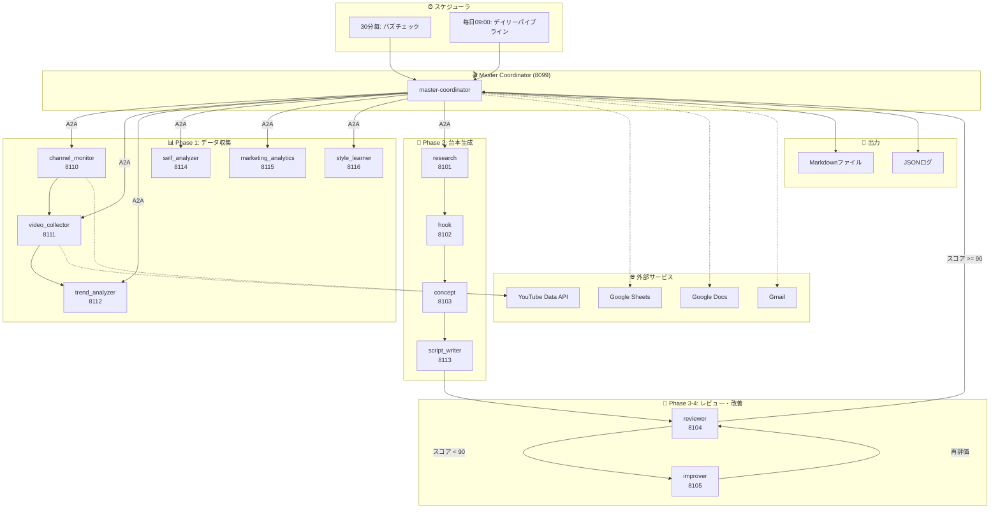
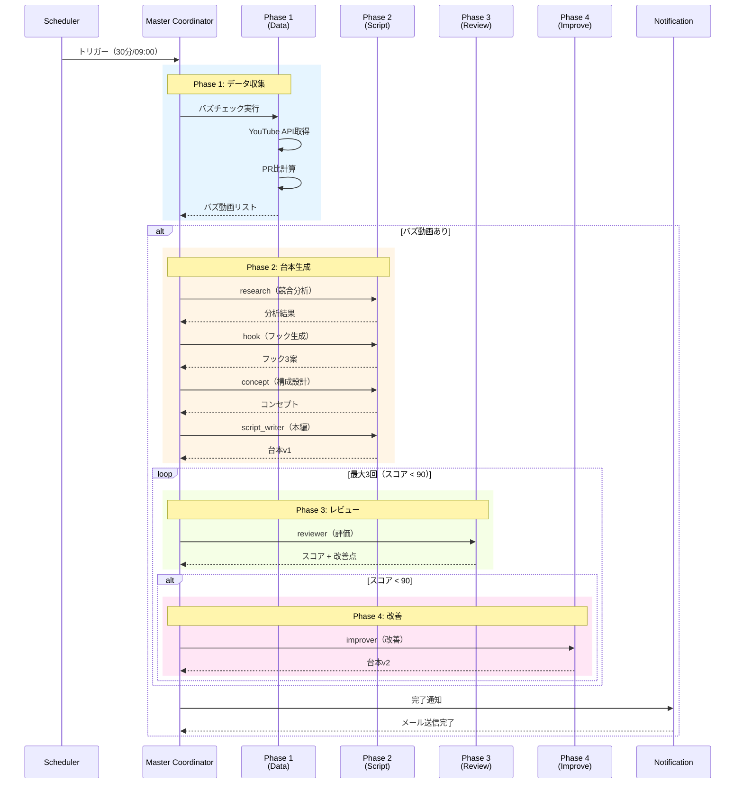
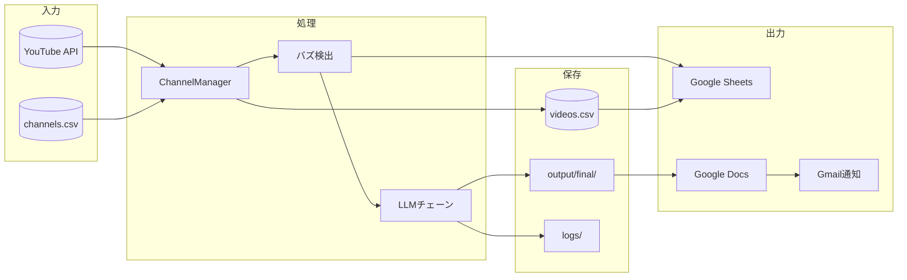
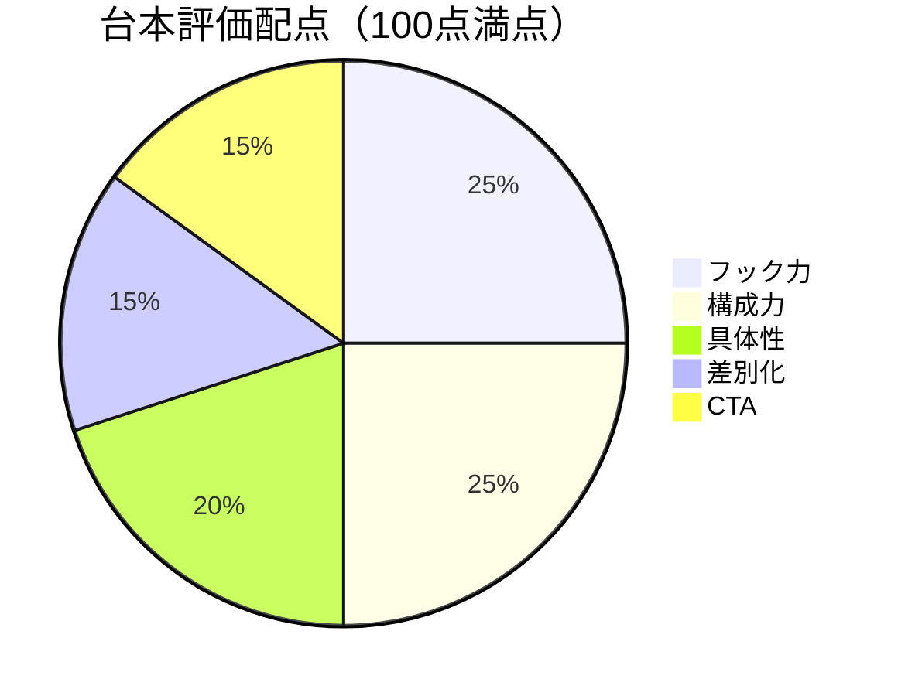
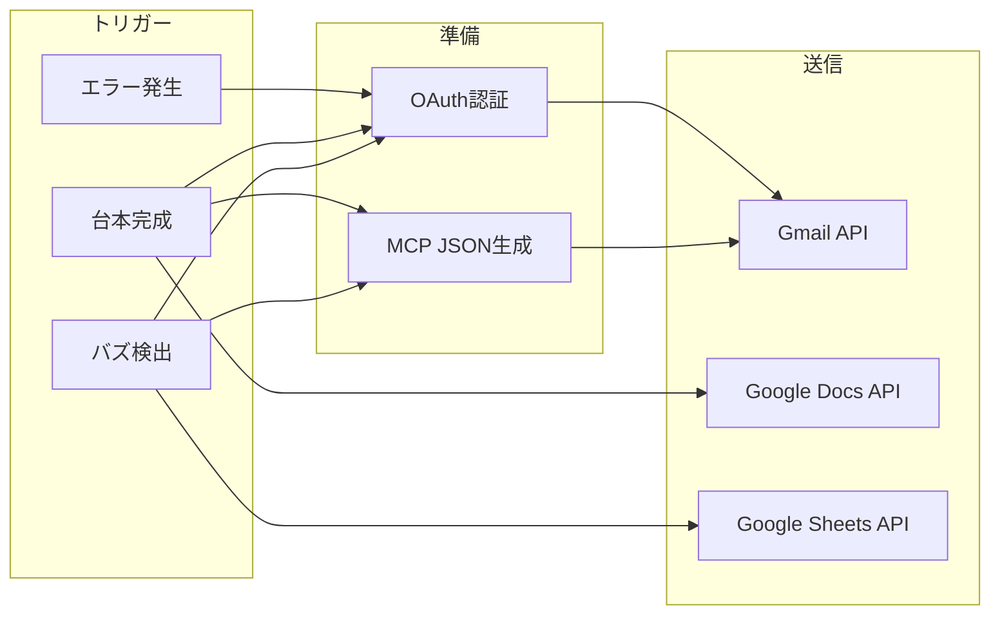
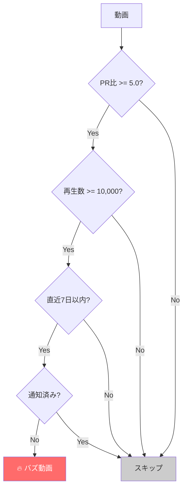
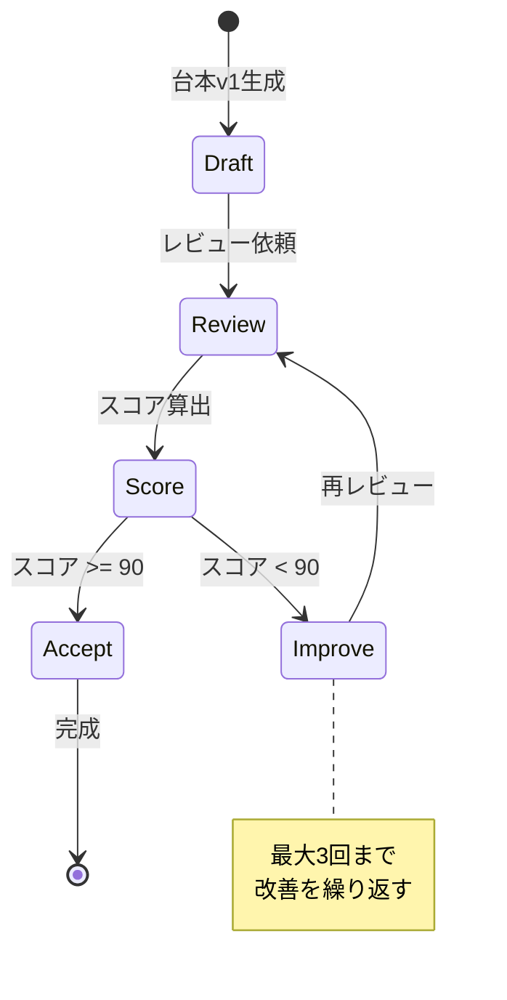

# YouTube台本自動生成システム - システムアーキテクチャ

## 概要

YouTube台本を完全自動で生成するA2A（Agent-to-Agent）マルチエージェントシステム。
バズ動画検出から台本生成、レビュー・改善、通知までを人間の介入なしで実行。

---

## システム全体図



---

## エージェント一覧

### Master Coordinator（統括）

| ポート | エージェント名 | 役割 | 説明 |
|--------|---------------|------|------|
| 8099 | master-coordinator | オーケストレーター | 全Phase統括、スケジューリング、通知 |

### Phase 1: データ収集エージェント

| ポート | エージェント名 | 役割 | 説明 |
|--------|---------------|------|------|
| 8110 | channel_monitor | チャンネル監視 | 登録チャンネルの新着動画を監視 |
| 8111 | video_collector | 動画データ収集 | YouTube APIから動画メタデータ取得 |
| 8112 | trend_analyzer | トレンド分析 | バズ動画検出、PR比計算 |
| 8114 | self_analyzer | 自チャンネル分析 | 自分のチャンネルのパフォーマンス分析 |
| 8115 | marketing_analytics | KPI分析 | マーケティング指標の追跡 |
| 8116 | style_learner | スタイル学習 | 成功動画のスタイルパターン学習 |

### Phase 2: 台本生成エージェント（LLM）

| ポート | エージェント名 | 役割 | 説明 |
|--------|---------------|------|------|
| 8101 | research | 競合分析 | バズ動画の成功要因を分析 |
| 8102 | hook | フック生成 | 冒頭の引きを作成（3案） |
| 8103 | concept | コンセプト設計 | 台本の構成・方向性を決定 |
| 8113 | script_writer | 本編作成 | 完全な台本を執筆 |

### Phase 3-4: レビュー・改善エージェント（LLM）

| ポート | エージェント名 | 役割 | 説明 |
|--------|---------------|------|------|
| 8104 | reviewer | 100点満点評価 | 5軸（フック/構成/具体性/差別化/CTA）で採点 |
| 8105 | improver | 台本改善 | 低スコア軸を重点的に改善 |

---

## パイプラインフロー



---

## データフロー



---

## スケジューラ設定

```mermaid
gantt
    title 1日のスケジュール
    dateFormat HH:mm
    axisFormat %H:%M

    section バズチェック
    00:00 :milestone, m1, 00:00, 0m
    00:30 :milestone, m2, 00:30, 0m
    01:00 :milestone, m3, 01:00, 0m
    01:30 :milestone, m4, 01:30, 0m

    section デイリーパイプライン
    09:00 フルパイプライン :crit, daily, 09:00, 30m
```

### APScheduler設定

| ジョブ名 | トリガー | 間隔 | 説明 |
|---------|---------|------|------|
| buzz_check | IntervalTrigger | 30分 | バズ動画監視 |
| daily_pipeline | CronTrigger | 09:00 | フルパイプライン実行 |

---

## 設定パラメータ

### OrchestratorConfig

```python
@dataclass
class OrchestratorConfig:
    # 定期実行
    buzz_check_interval_minutes: int = 30
    daily_run_hour: int = 9
    daily_run_minute: int = 0

    # バズ判定
    buzz_threshold: float = 5.0      # PR比閾値
    buzz_min_views: int = 10000      # 最小再生数
    buzz_days: int = 7               # 直近N日

    # 台本生成
    max_daily_scripts: int = 3       # 1日最大生成数
    target_score: int = 90           # 合格スコア
    max_improve_iterations: int = 3  # 最大改善回数

    # 通知
    notify_on_buzz: bool = True
    notify_on_complete: bool = True
```

---

## API エンドポイント

### Master Coordinator (8099)

| メソッド | パス | 説明 |
|---------|------|------|
| GET | `/.well-known/agent.json` | Agent Card |
| POST | `/a2a/tasks/send` | A2Aタスク送信 |
| GET | `/a2a/tasks/{task_id}` | タスク状態取得 |
| GET | `/status` | システム状態 |
| POST | `/trigger/buzz-check` | 手動バズチェック |
| POST | `/trigger/full-pipeline` | 手動パイプライン |

---

## ファイル構成

```
YouTube/
├── agents/
│   ├── master_coordinator/
│   │   └── server.py          # 統括エージェント（8099）
│   ├── research/
│   │   └── server.py          # 競合分析（8101）
│   ├── hook/
│   │   └── server.py          # フック生成（8102）
│   ├── concept/
│   │   └── server.py          # コンセプト（8103）
│   ├── reviewer/
│   │   └── server.py          # レビュー（8104）
│   ├── improver/
│   │   └── server.py          # 改善（8105）
│   ├── channel_monitor/
│   │   └── server.py          # チャンネル監視（8110）
│   ├── video_collector/
│   │   └── server.py          # 動画収集（8111）
│   ├── trend_analyzer/
│   │   └── server.py          # トレンド分析（8112）
│   ├── script_writer/
│   │   └── server.py          # 台本作成（8113）
│   ├── self_analyzer/
│   │   └── server.py          # 自己分析（8114）
│   ├── marketing_analytics/
│   │   └── server.py          # KPI分析（8115）
│   └── style_learner/
│       └── server.py          # スタイル学習（8116）
├── research/
│   ├── channel_manager.py     # チャンネル管理
│   ├── data/
│   │   ├── channels.csv       # チャンネルリスト
│   │   └── videos.csv         # 動画データ
│   └── transcripts/           # 字幕キャッシュ
├── output/
│   ├── final/                 # 完成台本
│   ├── scripts/               # 中間出力
│   └── notified_videos.json   # 通知済み追跡
├── logs/
│   └── master_coordinator.log
└── _shared/
    ├── a2a_base_server.py     # A2Aベースクラス
    ├── a2a_client.py          # A2Aクライアント
    ├── google_notifier.py     # OAuth通知
    ├── mcp_email_sender.py    # MCP通知
    └── sheets_logger.py       # Sheets連携
```

---

## レビュー評価軸



| 評価軸 | 配点 | 説明 |
|--------|------|------|
| フック力 | 25点 | 冒頭3秒で視聴者を引き込む力 |
| 構成力 | 25点 | 論理的な流れ、起承転結 |
| 具体性 | 20点 | 数値、事例、データの充実度 |
| 差別化 | 15点 | 競合との違い、独自性 |
| CTA | 15点 | 行動喚起の明確さ |

---

## 通知フロー



---

## 起動方法

### 全システム起動（EC2）

```bash
# systemdサービス
sudo systemctl start youtube-master-coordinator

# または手動
cd /home/ec2-user/A2A/SNS/YouTube
source venv/bin/activate
ENABLE_SCHEDULER=true python agents/master_coordinator/server.py
```

### 個別エージェント起動

```bash
# Phase 1 エージェント
./start_phase1_agents.sh  # 8110-8116

# Phase 2-4 エージェント
./start_agents.sh         # 8101-8105, 8113

# Master Coordinator
python agents/master_coordinator/server.py --port 8099 --with-scheduler
```

### 手動トリガー

```bash
# バズチェック
curl -X POST http://localhost:8099/trigger/buzz-check

# フルパイプライン
curl -X POST http://localhost:8099/trigger/full-pipeline

# システム状態確認
curl http://localhost:8099/status
```

---

## バズ判定ロジック



**PR比（Performance Ratio）計算:**
```
PR = 再生数 / チャンネル登録者数
```

---

## 改善ループ



---

## 技術スタック

| カテゴリ | 技術 |
|---------|------|
| 言語 | Python 3.11+ |
| Webフレームワーク | FastAPI + Uvicorn |
| スケジューラ | APScheduler |
| A2A通信 | httpx（非同期HTTP） |
| LLMバックエンド | Claude Code CLI + Task tool |
| 外部API | YouTube Data API v3 |
| 認証 | Google OAuth 2.0 |
| 出力 | Google Sheets / Docs / Gmail |

---

*最終更新: 2024-12-12*
